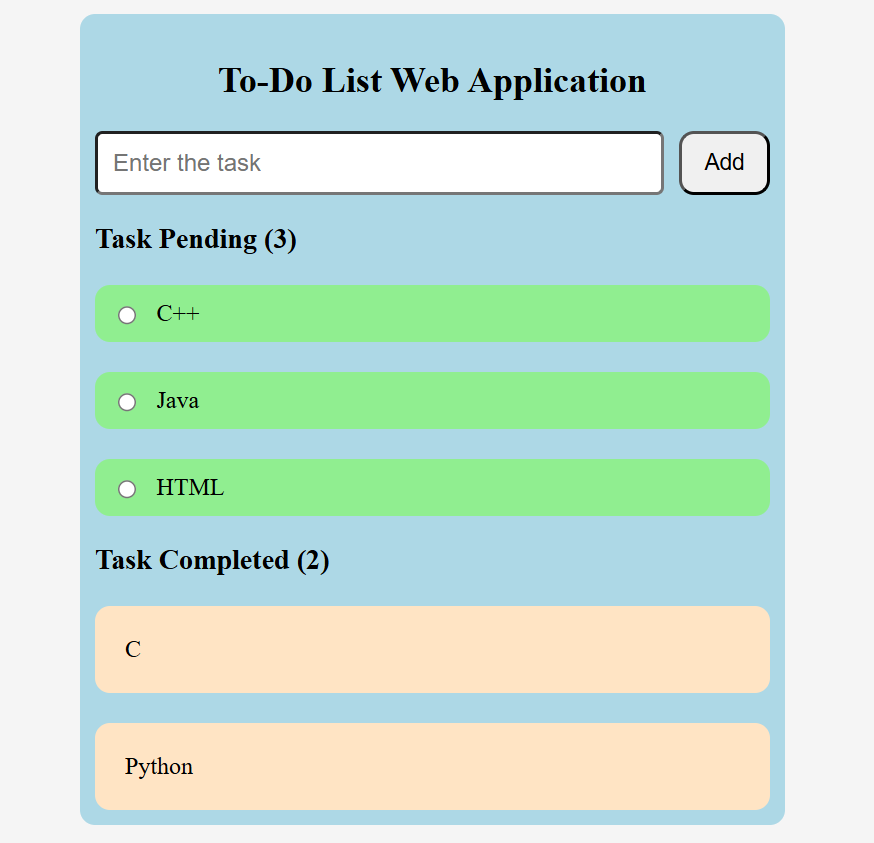

# To-Do List Web Application

A simple and interactive To-Do List web application developed using HTML, CSS, and JavaScript. The application allows users to add tasks, track pending tasks, mark tasks as completed, and monitor task counts dynamically without refreshing the page.

## Features

* Add new tasks instantly
* Display pending tasks count
* Mark tasks as completed
* Display completed tasks count
* Dynamic updates without page refresh
* User-friendly interface
* Lightweight and fast-loading application
* Beginner-friendly JavaScript project

## Technologies Used

* HTML5
* CSS3
* JavaScript (Vanilla JS)

## Project Structure

```text
Todo_Project/
│
├── todo project.html
│
└── Image/
    └── screenshot.png
```

## Screenshots

### Application Interface



## How to Run

1. Download or clone the repository.
2. Open `todo project.html` in any modern web browser.
3. Enter a task in the input field.
4. Click the **Add** button to create a new task.
5. Mark a task as completed using the radio button.
6. View pending and completed task counts update automatically.

## Purpose

This project was developed to practice front-end web development concepts such as JavaScript functions, event handling, DOM manipulation, dynamic content rendering, and user interaction using HTML, CSS, and JavaScript.

## Learning Outcomes

Through this project, developers can gain experience in:

* JavaScript Functions
* Event Handling
* DOM Manipulation
* Dynamic Content Updates
* User Input Handling
* Task Management Logic
* Front-End Development Fundamentals

## Future Enhancements

* Add task deletion functionality
* Add task editing functionality
* Store tasks using Local Storage
* Add task priorities
* Add due dates and reminders
* Improve UI responsiveness
* Add drag-and-drop task management
* Implement dark mode support

## Author

**Malla Venkata Varun Teja**

B.Tech in Computer Science and Engineering

Software Engineering Fresher seeking opportunities in the IT industry to apply and strengthen skills in web development, software engineering, and problem-solving.